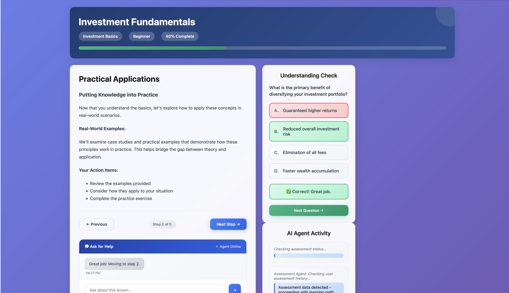

# Understanding Agents

AI-powered financial literacy platform built with multi-agent architecture for Shell Hacks 2025.


## What It Does

Personalized financial education through four AI agents that assess knowledge, create learning paths, track progress, and deliver content. Users complete an assessment and receive a customized curriculum covering investment basics, risk management, portfolio building, retirement planning, and budgeting.

## Architecture

```
Frontend (Angular) → Assessment Agent → Planning Agent → Progress Agent → Content Agent
                              ↓
                       SQLite Database
```

**Agent Ports:**
- Assessment: 8000
- Planning: 8001  
- Progress: 8002
- Content: 8003


## Tech Stack

**Frontend:** Angular 19, TypeScript, Auth0  
**Backend:** Python 3.13, Google ADK, Gemini 2.0, Flask, SQLite

## Setup

### Backend
```bash
cd backend
python3 -m venv .venv
source .venv/bin/activate
pip install -r requirements.txt

# Add GOOGLE_API_KEY to .env
# Add GOOGLE_GENAI_USE_VERTEXAI=FALSE

# Set up CORS
python3 cors_wrapper.py

# Start agents (separate terminals)
./run.sh

# To terminate agents
./stop.sh
```

### Frontend
```bash
cd frontend
npm install
# Configure Auth0 in auth.config.ts
ng serve
```



## Usage

1. Sign in with Auth0
2. Complete financial literacy assessment
3. Receive personalized learning path
4. Progress through 6 modules with interactive content
5. Track completion and earn certificates

## Project Structure

```
├── frontend/src/app/
│   ├── agent-dashboard/
│   ├── learning-page/
│   ├── assessment/
│   └── agent.service.ts
└── backend/
    ├── assessment_agent/
    ├── planning_agent/
    ├── progress_agent/
    ├── content_delivery_agent/
    └── shared/db_service.py
```

## Key Features

- Conversational assessment
- Risk tolerance profiling
- Adaptive learning paths
- Real-time progress tracking
- Interactive quizzes
- Step-by-step lessons

## Built With

Shell Hacks 2025 - 36 hour hackathon


## License

MIT
